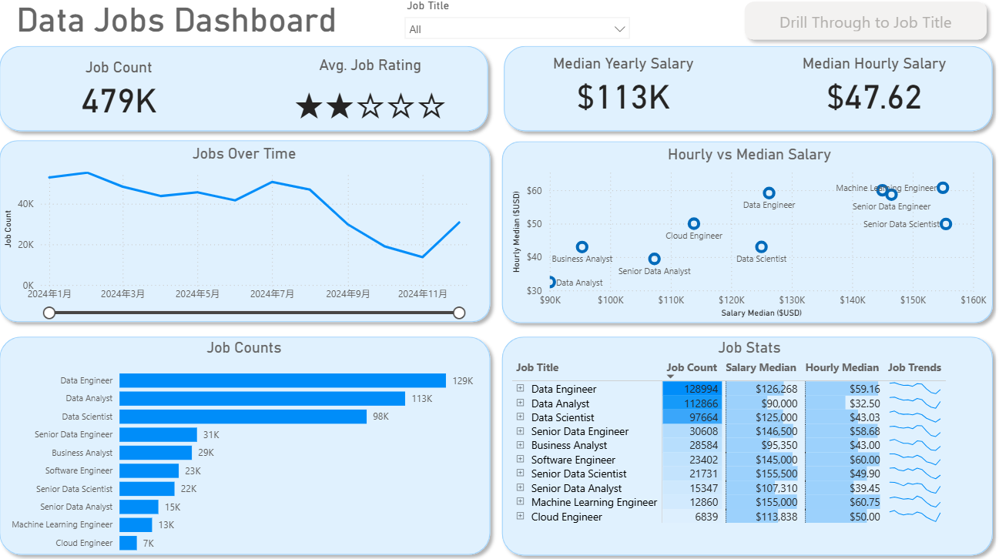
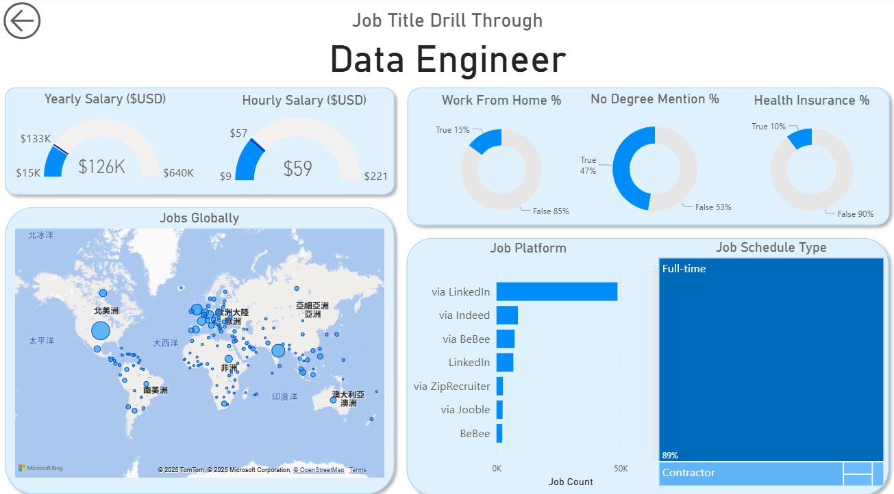
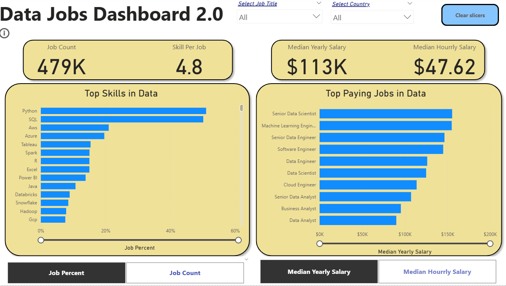

## Welcome to my Power BI project. In this session, we will explore a series of dashboards featuring various charts, gain insights into the concepts behind Power Query and DAX, and demonstrate how to interact with and manipulate visualizations using Parameters and Slicers.
  

[Luke Barousse Power BI Source](https://drive.google.com/drive/folders/1DWmAUNAuamqinMvpQiko_bZzXKG7JEr5)

### ✎𓂃Quick Notes before diving in: ✎𓂃
**What is DAX?**  
A formula language used to create custom calculations, such as measures and calculated columns, so you can analyze and manipulate data beyond what’s available in your raw dataset.

# 📝Project1
## Page 1

### The purpose of the Dashboard:
- Job availability (count and trend)
- Salary comparisons (yearly and hourly)
- Job satisfaction (via star ratings)
- Ranking of data-related roles by pay and popularity

(It’s designed for data professionals, recruiters, or career analysts seeking quick, visual insights into job trends and compensation patterns.)

### 📈 1. Job Trend in 2024

- **Observation:** Job count started high (≈55K in Jan) and declined mid-year (≈30K in Sept), rebounding slightly in November (≈31K).

- **Insight:**
    - Suggests possible seasonal hiring patterns or a mid-year slowdown (common when budgets reset or hiring freezes occur).

    - A strong year-end recovery could indicate renewed hiring momentum for 2025.

### ⚖️ 2. Hourly vs. Yearly Salary of Data Jobs

- **Trend:**

    - Software Engineer, Machine Learning Engineer, and Senior Data Scientist are positioned in the high salary range ($140K–$160K+).

    - Data Analyst and Business Analyst sit lower (~$90K–$110K range).

- **Insight:**

    - Technical and senior roles (engineering, ML, senior science) command higher pay due to skill specialization.

    - Analysts have lower pay but possibly broader job availability.

### 💰 3. Highest Paying Jobs in Data

- **Top Role: Data Engineer**

- Followed by **Data Analyst** and **Data Scientist**.

- **Insight:**

    - Data Engineers lead both in job count and median salary, showing they are in highest demand and value.

    - This aligns with the market trend — organizations need engineers to build and maintain data infrastructure before analysis and ML can occur.

### 🧠 Dashboard Insights Summary

The **Data Jobs Dashboard** provides a clear overview of the 2024 data job market, highlighting key metrics such as job availability, salary trends, and role performance. With a total of **479K job postings** and a **median yearly salary of $113K**, the data field remains strong and competitive. **Data Engineers** lead both in job count and pay, reflecting the growing demand for infrastructure and pipeline expertise. Meanwhile, **Senior Data Scientists** and **Machine Learning Engineers** command the highest salaries, underscoring the premium placed on advanced analytics and AI skills. Although job postings dipped mid-year, the upward trend in late 2024 suggests renewed market momentum. Overall, the dashboard illustrates a robust, high-value landscape for data professionals heading into 2025.

## Page 2 (Drill Through)

## 🧭 Purpose of the Drill Through

This drill-through page provides a **deeper exploration of a selected job role from the Main dashboard (Page 1)**. It allows users to examine specific details about that job’s salary structure, work conditions, location patterns, and job sources. Each visual focuses on a different dimension of the role, giving a complete understanding of what defines it in the data job market.

### 💰 Yearly and Hourly Salary Gauges

These two gauges display the **median compensation values** for the selected job title — both annual and hourly.
They help users understand the **typical pay range** within that role and how it compares to others. The gauges also show the **minimum and maximum values**, reflecting salary variation across different regions, experience levels, or companies.

### 🏡 WFH (Work-From-Home) Percentage

This donut chart indicates what proportion of job listings offer **remote or hybrid work options**.
It provides quick insight into the **work flexibility** associated with the selected role — whether it’s a job that tends to be performed remotely or primarily on-site.

### 🎓 No Degree Mention Percentage

This visual highlights the share of postings that **do not explicitly require a formal degree**.
It reflects the **employer’s emphasis on practical skills** versus educational credentials, which is particularly relevant for roles that value technical ability over academic background.

### 🏥 Health Insurance Percentage

This chart shows how many job listings mention **health insurance or related benefits**.
It gives users a sense of **how transparent job postings are about benefits** and what proportion of employers highlight them as part of their offer.

### 🌍 Global Job Distribution Map

This map displays the **geographical spread** of job opportunities for the selected title.
Each point represents one or more postings, allowing users to see **which regions have the highest demand for that role**.
It helps reveal patterns such as where hiring is concentrated — for example, in certain continents, tech hubs, or emerging markets.

### 💼 Job Platform Comparison

This bar chart shows the **distribution of job postings across various platforms** (e.g., LinkedIn, Indeed, ZipRecruiter).
It identifies **where most opportunities are listed**, guiding job seekers toward the platforms most relevant for that career path.

### 🧱 Job Type Breakdown

The treemap visual represents the **types of positions available**, such as Full-time, Contract, Internship, or Part-time.
It allows users to quickly assess **how the employment structure differs across roles**, showing whether the job is typically long-term, project-based, or short-term.

## 🏁 Conclusion of Project 1

Together, the two dashboard pages provide a comprehensive view of the data job market in 2024, combining both macro-level trends and role-specific insights.

 - **The first page (Main Dashboard)** presents a broad overview of the entire data profession — showcasing total job availability, salary benchmarks, rating trends, and how different roles compare in pay and demand. It gives users an immediate understanding of the **overall landscape**, helping identify which roles are most sought-after and how compensation varies across the field.

 - **The second page (Drill-Through Page)** allows users to **explore any individual job title in greater depth**. Once a role is selected, it reveals details such as salary range, work-from-home prevalence, education requirements, benefit mentions, global job locations, and the platforms where those roles are most often listed. This page turns high-level data into specific, actionable insights for that job category.

Together, these dashboards transform raw job market data into an interactive analytical tool.
They help recruiters, analysts, and career professionals understand not only where opportunities exist but also what defines each role — from pay structure to various working conditions.

# 📝Project2
## Overview:

1. How many data jobs exist
2. What skills are most in-demand
3. What data roles pay the most
4. Salary benchmarks (yearly & hourly)
5. How job titles and countries affect results (through slicers)  

Essentially, it’s a market-insight dashboard that helps job seekers, analysts, and hiring teams understand which skills matter most and which positions offer the highest pay.

## 📜 Top Metrics at the Top
### 1. Job Count: 479K
- There are around 479,000 data-related job postings in the dataset.
- This indicates a very large and active job market.

### 2. Skill Per Job: 4.8
- On average, each job posting requires almost 5 distinct skills.
- This highlights the broad skill expectations in the data field.

### 3. Median Yearly Salary: $113K
- The middle salary for data jobs is quite strong.
- Indicates that data careers are generally well-compensated.

### 4. Median Hourly Salary: $47.62
- Provides an alternative pay benchmark, useful for contractors or freelancers.

## 📊Left Chart: Top Skills in Data

A horizontal bar chart showing which skills appear most often in data job postings.

### 💡Key Insights

- Python and SQL dominate the list — by far the most required skills (around 55–60% of job postings).

- AWS and Azure appear next, showing strong demand for cloud platforms.

- Visualization tools (Tableau, Power BI, Excel) also rank high.

- Big data tools (Spark, Databricks, Snowflake, Hadoop) appear in mid/lower tier but still important.

**👉Implication:**
 If someone wants to enter or grow in data careers, Python + SQL + one cloud + one visualization tool would cover the majority of job requirements.

## 📊Right Chart: Top Paying Jobs in Data

A ranked bar chart showing the highest median salaries for specific roles.

### Top Roles Noted

- Senior Data Scientist (highest)  
- Machine Learning Engineer  
- Senior Data Engineer  
- Software Engineer (in the data context)  
- Data Engineer
- Data Scientist
- Cloud Engineer
- Senior Data Analyst
- Business Analyst
- Data Analyst

### 💡Key Insights

- Senior-level roles (Data Scientist, ML Engineer, Senior Engineer) pay the most — often in the $150K–$180K range.

- Mid-level roles (Data Scientist, Data Engineer) are around $120K–$140K.

- Analyst roles pay less, but still competitive.

**👉Implication:**: More specialized or advanced roles yield significantly higher compensation.

## ᯤ Slicers at the Top ᯤ

### 📅Filters and buttons
1. **Job Title**
2. **Country**
3. **Clear slicers**

**_This allows users to:_**

- Filter charts by specific job roles (e.g., Data Scientist only)
- Compare salaries across countries
- View skill requirements per role
- Reset the dashboard easily

## 🎯Conclusion
The Data Jobs Dashboard provides a comprehensive snapshot of data-driven job market. The analysis shows that demand remains extremely high, with nearly half a million open roles and a strong median salary of $113K. Employers consistently seek candidates with a blend of programming, cloud, and analytical skills — especially Python, SQL, and major cloud platforms.

The highest-paying opportunities are concentrated in advanced and senior positions such as Senior Data Scientist, Machine Learning Engineer, and Senior Data Engineer, reflecting the growing need for expertise in AI, automation, and large-scale data systems.

Overall, highlights a market where skilled data professionals are in strong demand, broad skill sets are rewarded, and continuous learning is essential for reaching top-tier roles and salary levels.